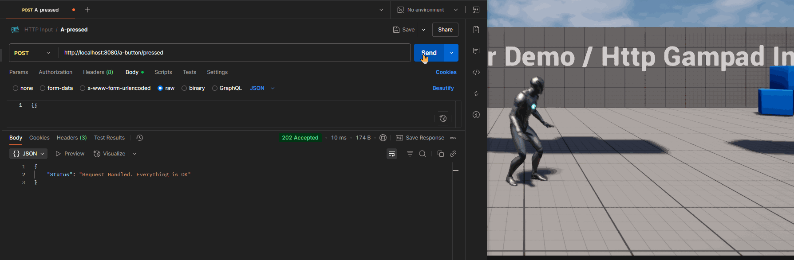

# RESTful API server на Unreal Engine на примере Input через HTTP

Недавно передо мной встала интересная задача: организовать удалённый запуск сценариев в приложении на Unreal Engine с мобильного устройства. 

Представим упрощённую ситуацию: на компьютере запущено приложение на Unreal Engine (назовём это инсталляцией), а у нас есть мобильное устройство, с которого необходимо передавать команды на эту инсталляцию. Это может быть как сложная мультимедийная инсталляция уровня [змейка на фасаде здания](https://youtu.be/vib8cg4IFUc?si=W1ujuoAHuQ8JHHmB), так и более простой пример — управление игровым персонажем с телефона, как с геймпада.

Очевидно, здесь возникает типичная архитектура клиент–сервер. Однако есть важное ограничение: реализация не должна использовать встроенные механизмы Unreal Engine, такие как RPC или репликация, поскольку платформа клиента и используемый стек могут быть заранее неизвестны. Но и плодить лишних инфраструктурных прослоек в виде дополнительных веб сервисов / микросервисов на каком-то ещё одном стеке - не хочется.

В этом контексте я хочу поделиться своим подходом к решению задачи — запуском HTTP-сервера непосредственно в Unreal Engine и реализацией HTTP-геймпада на мобильной стороне в качестве клиента. Это позволит не привязываться к конкретной платформе клиента и, в целом, открывает интересные возможности для интеграции удалённых интерфейсов с UE-приложениями.


## Концептуальная схема

Архитектура описанной выше системы может выглядеть следующим образом:

* на компьютере запущен проект Unreal Engine, в котором есть игровая сцена с персонажем. HTTP-сервер, встроенный в проект, принимает команды от клиента и инициирует действия в сцене;

* мобильное устройство запускает приложение-геймпад, представляющее собой простой пользовательский интерфейс для отправки HTTP команд на сервер.

Оба устройства находятся в одной локальной сети и подключены через Wi-Fi, в частном случае, но могут быть просто подключены к интернету в общем случае. При нажатии кнопки на мобильном геймпаде формируется HTTP-запрос, который отправляется на сервер, работающий внутри UE-проекта. Unreal Engine обрабатывает этот запрос, интерпретирует его как управляющую команду и, соответственно, перемещает персонажа в сцене.

Такое решение демонстрирует простой, но эффективный способ удалённого взаимодействия с игровым процессом через стандартный HTTP-протокол, без необходимости использовать встроенные RPC-механизмы или сторонние инструменты.


## Что есть в движке для реализации сервера

Unreal Engine предоставляет широкий набор модулей и плагинов, многие из которых позволяют решать разные задачи буквально «из коробки». Когда речь заходит о создании собственного сервера внутри UE-приложения, у разработчика есть несколько стратегий. Рассмотрим ключевые из них:

1. Модуль `Sockets`
Это низкоуровневый API для работы с сокетами, абстрагирующий платформенные различия. С его помощью можно вручную реализовать HTTP-сервер — от обработки TCP-соединений до парсинга HTTP-заголовков. Такой подход обеспечивает максимальную гибкость, но требует значительных затрат времени и ресурсов на реализацию протокольной логики. Он подойдёт тем, кому необходим полный контроль, но его сложно рекомендовать для быстрых MVP или легковесных решений.

2. Модуль `Runtime/Online/HTTPServer`
Появился в Unreal Engine примерно с версии 4.25 (c мая 2019). Это встроенный HTTP-серверный модуль, позволяющий легко развернуть REST-интерфейс прямо внутри UE без необходимости использовать сторонние технологии вроде Node.js, Python или дополнительных плагинов. Несмотря на скудную документацию, он отлично подходит для построения компактных и производительных API, особенно в случае кроссплатформенных решений и ограничений на использование внешнего ПО.

3. Плагин `RemoteControl`
Также появился примерно в 2019 году и работает поверх HTTPServer. Предназначен для управления объектами и параметрами в сцене через HTTP-запросы. `RemoteControlAPI` предоставляет доступ к акторам, компонентам и их свойствам. Однако у него есть критичное ограничение — необходимо заранее знать структуру сцены, имена объектов и их свойства, что снижает гибкость при динамически изменяющемся контенте.

Сравнив доступные опции, я пришёл к выводу, что наиболее эффективным решением в моём случае стал модуль `HTTPServer`. Он сочетает в себе нативность, достаточную производительность и свободу в построении логики. Для удобства я реализовал обёртку, упрощающую маршрутизацию, обработку запросов и генерацию ответов, избавляя от рутины и ускоряя разработку.

Это решение оказалось гибким, лёгким в интеграции и отлично масштабируется под конкретные задачи — от простого управления сценой до сложных удалённых интерфейсов.

## Wrapper для HTTPServer

Для реализации RESTful API сервера, мне показалось удобным, если набор endpoints можно будет задавать через конфиг, тем самым убирая или добавляя методы взаимодействия с UE приложением. Поэтому я написал обвёртку для встроенного `HTTPServer` модуля и положил её в плагин на GitHub:

https://github.com/lpestl/HttpServerPlugin

Решение получилось простым, легко настраиваемым и особенно удобным для быстрого прототипирования и MVP. Достаточно подключить плагин, указать конфигурацию — и можно начинать обрабатывать HTTP-запросы прямо в проекте, отправляя как дефолтные, так и кастомные ответы. Если вас не интересует внутренняя реализация, этот раздел можно пропустить.

Для большинства сценариев, особенно на ранних стадиях разработки, когда не требуется передача больших объёмов данных, всё можно реализовать даже через Blueprint.

Для конфигурации я создал структуру `FEndpointData` и класс `UHttpServerSettings`, обеспечивающий удобную настройку и подключение обработчиков:

```C++
USTRUCT(BlueprintType)
struct HTTPSERVERWRAPPERMODULE_API FEndpointData
{
	GENERATED_BODY()

	UPROPERTY(EditAnywhere, BlueprintReadWrite)
	FString Endpoint {};

	UPROPERTY(EditAnywhere, BlueprintReadWrite)
	EHttpServerWrapperRequestVerbs Verbs {};
}; 


UCLASS(DisplayName="HTTP Server Settings", Config = "HttpServer", DefaultConfig)
class HTTPSERVERWRAPPERMODULE_API UHttpServerSettings : public UDeveloperSettings
{
	GENERATED_BODY()

public:
    /*
    Something else
    */
	
private:
	UPROPERTY(meta = (AllowPrivateAccess = "true"), Config, EditAnywhere, BlueprintReadOnly, Category = "General")
	int32 Port { 8080 };
	
	UPROPERTY(meta = (AllowPrivateAccess = "true"), Config, EditAnywhere, BlueprintReadOnly, Category = "General")
	TArray<FEndpointData> Endpoints {};
};
```

Оформление `UHttpServerSettings` как потомка `UDeveloperSettings` позволяет редактировать параметры прямо в редакторе: `UnrealEditor → Project Settings`:


Основной класс плагина реализует абстракцию HTTP-сервера — он помечен как BlueprintType, Blueprintable, чтобы иметь возможность взаимодействовать с ней в блюпринтах. 

```C++
UCLASS(BlueprintType, Blueprintable)
class HTTPSERVERWRAPPERMODULE_API UHttpServer : public UObject
```

Ключевые методы управления — запуск и остановка сервера:

```C++
    UFUNCTION(BlueprintCallable, Category = "HttpServer")
	void StartApiServer();
	
	UFUNCTION(BlueprintCallable, Category = "HttpServer")
	void StopApiServer();
```

Инициализация сервера включает привязку всех описанных в конфиге endpoint'ов к обработчику, а завершение работы — корректную очистку маршрутов. Всё реализовано через:

```C++
//~~~ HEADER ~~~ 
// Добавим вспомогательные поля в класс в HEADER
private:	
	/** Http router handle */
	TSharedPtr<IHttpRouter> HttpRouter;
	
	/** Mapping of routes to delegate handles */
	TMap<FString, FHttpRouteHandle> ActiveRouteHandles;

//~~~ CPP ~~~ 
// И реализуем логику запуска "слушателей" (запуск самого сервера)
void UHttpServer::StartApiServer()
{
	FHttpServerModule& HttpServerModule = FHttpServerModule::Get();

    // Берём настройки/конфиг
	UHttpServerSettings* Settings = UHttpServerSettings::Get();
	if (IsValid(Settings))
	{
		if (HttpRouter)
		{
			HttpRouter.Reset();
		}
		HttpRouter = FHttpServerModule::Get().GetHttpRouter(Settings->GetPort(), /* bFailOnBindFailure = */ true);
		UE_LOG(LogHttpServerPlugin, Log, TEXT("Starting HttpServer on %d port:"), Settings->GetPort());
		
		TArray<FEndpointData> Endpoints = Settings->GetEndpoints();
		for (FEndpointData& EndpointData : Endpoints)
		{
			FHttpPath EndpointPath = EndpointData.Endpoint;
			EHttpServerRequestVerbs Verbs = static_cast<EHttpServerRequestVerbs>(EndpointData.Verbs);

			ActiveRouteHandles.Add(
				EndpointData.Endpoint,
                /* Тут создаём обрабочик HTTP запроса и дополнительным параметром передаём данные об Endpoint */
				HttpRouter->BindRoute(
					EndpointPath,
					Verbs,
					FHttpRequestHandler::CreateUObject(this, &UHttpServer::HandleRequest, EndpointData)
				)
			);
			UE_LOG(LogHttpServerPlugin, Log, TEXT("\t%s: %s "), *StaticEnum<EHttpServerWrapperRequestVerbs>()->GetNameStringByValue(static_cast<int64>(EndpointData.Verbs)), *EndpointData.Endpoint);
		}

        // Запускаем слушателей
		HttpServerModule.StartAllListeners();
	}
}

// При этом нужно не забыть корректно останавливать сервер
void UHttpServer::StopApiServer()
{
    // Если доступен движковый HTTP Server модуль
	if (FHttpServerModule::IsAvailable())
	{        
		FHttpServerModule& HttpServerModule = FHttpServerModule::Get();
        // Стопаем слушателей
		HttpServerModule.StopAllListeners();
		
		UHttpServerSettings* Settings = UHttpServerSettings::Get();
		if (IsValid(Settings))
		{
			TArray<FEndpointData> Endpoints = Settings->GetEndpoints();
			UE_LOG(LogHttpServerPlugin, Log, TEXT("Unbound endpoints:"));
			// Пройдём по всем "наконфиженным" ендпоинтам
			for (FEndpointData& EndpointData : Endpoints)
			{
				if (ActiveRouteHandles.Find(EndpointData.Endpoint) != nullptr)
				{
					if (ActiveRouteHandles[EndpointData.Endpoint].IsValid())
					{
						UE_LOG(LogHttpServerPlugin, Log, TEXT("\t* %s"), *EndpointData.Endpoint);
                        // И отпишемся от обработчика
						HttpServerModule.GetHttpRouter(Settings->GetPort())->UnbindRoute(ActiveRouteHandles[EndpointData.Endpoint]);
					}
				}
			}
		}
		ActiveRouteHandles.Reset();
	}

	if (HttpRouter)
	{
		HttpRouter.Reset();
	}
}
```

Дополнительно я предусмотрел возможность подписки на делегат, который вызывается при получении запроса. Это удобно, если нужно реагировать на события в Blueprint, не лезя в C++:

```C++
DECLARE_DYNAMIC_MULTICAST_DELEGATE_TwoParams(FOnReceivedRequest, const FString&, RequestBody, FEndpointData, EndpointData);

public:
	FOnReceivedRequest& OnReceivedRequest()
	{
		return Delegate_OnReceivedRequest;
	}
private:
	UPROPERTY(BlueprintAssignable)
	FOnReceivedRequest Delegate_OnReceivedRequest;
```

Для более продвинутой логики на стороне кода проекта можно переопределить виртуальный метод HandleRequest, в котором происходит обработка запроса и формирование ответа:

```C++
// In HEADER
virtual bool HandleRequest(const FHttpServerRequest& Request, const FHttpResultCallback& OnComplete, FEndpointData EndpointData);

// In CPP
bool UHttpServer::HandleRequest(const FHttpServerRequest& Request, const FHttpResultCallback& OnComplete,
	FEndpointData EndpointData)
{
	FString RequestBody = FString(Request.Body.Num(), UTF8_TO_TCHAR(Request.Body.GetData()));
	UE_LOG(LogHttpServerPlugin, Log, TEXT("Received request: \n%s"), *RequestBody);

	// Parse JSON from body request
	TSharedPtr<FJsonObject> JsonRequest;
	TSharedRef<TJsonReader<>> Reader = TJsonReaderFactory<>::Create(RequestBody);

	if (!FJsonSerializer::Deserialize(Reader, JsonRequest) || !JsonRequest.IsValid())
	{
		return ProcessResponse(OnComplete, TEXT("Error"), TEXT("Invalid JSON format"), EHttpServerResponseCodes::BadRequest);
	}

	if (Delegate_OnReceivedRequest.IsBound())
	{
		Delegate_OnReceivedRequest.Broadcast(RequestBody, EndpointData);
	}
	
	return ProcessResponse(OnComplete, TEXT("Status"), TEXT("Request Handled. Everything is OK"), EHttpServerResponseCodes::Accepted);
}
```

Метод ProcessResponse реализует базовую отправку JSON-ответа, удобную для большинства простых случаев.

ВНИМАНИЕ: В более сложных случаях при переопределении метода `HandleRequest` нужно будет писать свою реализацию создания `HttpResponse`, но уже на уровне бизнес-логики.

```C++
bool UHttpServer::ProcessResponse(const FHttpResultCallback& OnComplete, const FString& Key, const FString& MessageText, EHttpServerResponseCodes ResponseCode)
{
	const bool bIsError = static_cast<uint16>(ResponseCode) >= 400;
	if (bIsError)
	{
		UE_LOG(LogHttpServerPlugin, Error, TEXT("%s: %s"), *Key, *MessageText);
	}
	else
	{
		UE_LOG(LogHttpServerPlugin, Log, TEXT("%s: %s"), *Key, *MessageText);
	}
	// Создаём JSON для тела ответа
	TSharedPtr<FJsonObject> MessageResponse = MakeShareable(new FJsonObject());
	// Добавляем ключ-значение
    MessageResponse->SetStringField(Key, MessageText);
    // Конвертируем в строку
	FString MessageResponseString;
	TSharedRef<TJsonWriter<>> Writer = TJsonWriterFactory<>::Create(&MessageResponseString);
	FJsonSerializer::Serialize(MessageResponse.ToSharedRef(), Writer);

    // Создаём ответ
	TUniquePtr<FHttpServerResponse> Response = FHttpServerResponse::Create(MessageResponseString, TEXT("application/json"));
	Response->Code = ResponseCode;
    // Вызываем Callback
	OnComplete(MoveTemp(Response));

	return !bIsError;
}
```

В итоге у нас есть абстракция `UHttpServer`, которую можно запускать, останавливать и кастомизировать. В зависимости от потребностей, её удобно инициализировать из `UGameInstanceSubsystem`, `UWorldSubsystem` или `AGameMode`.

Пример использования в GameMode:

```C++
#include "SomeNewGameMode.h"
#include "HttpServer.h"

void ASomeNewGameMode::BeginPlay()
{
    Super::BeginPlay();
    HttpServer = NewObject<UHttpServer>();
    HttpServer->OnReceivedRequest().AddDynamic(this, &ASomeNewGameMode::OnReceivedRequest);
    HttpServer->StartApiServer();
}

void ASomeNewGameMode::OnReceivedRequest(const FString& RequestBody, FEndpointData EndpointData)
{
    //...
}

void ASomeNewGameMode::EndPlay(const EEndPlayReason::Type EndPlayReason)
{
    HttpServer->StopApiServer();
    Super::EndPlay(EndPlayReason);
}
```

## Управление персонажем

Для демонстрации я буду использовать обычный `SideScrollerTemplate` адаптированный под UE 5.5. 


* Подлючим к проекту описанный в прошлом разделе плагин: https://github.com/lpestl/HttpServerPlugin
* Добавим к проекту зависимость на модуль, изменив в файле `*.Build.cs` следующую строку:

```C++
PublicDependencyModuleNames.AddRange(new string[] { "Core", "CoreUObject", "Engine", "InputCore", "HttpServerWrapperModule" });
```
* В конфиге `{project_path}/Config/DefaultHttpServer.ini` зададим перечень endpointов, которые будут отвечать за управление персонажем:

```ini
[/Script/HttpServerWrapperModule.HttpServerSettings]
Port=8080
+Endpoints=(Endpoint="/version",Verbs=VERB_GET)
+Endpoints=(Endpoint="/up/pressed",Verbs=VERB_POST)
+Endpoints=(Endpoint="/up/released",Verbs=VERB_POST)
+Endpoints=(Endpoint="/left/pressed",Verbs=VERB_POST)
+Endpoints=(Endpoint="/left/released",Verbs=VERB_POST)
+Endpoints=(Endpoint="/right/pressed",Verbs=VERB_POST)
+Endpoints=(Endpoint="/right/released",Verbs=VERB_POST)
+Endpoints=(Endpoint="/a-button/pressed",Verbs=VERB_POST)
+Endpoints=(Endpoint="/a-button/released",Verbs=VERB_POST)
+Endpoints=(Endpoint="/b-button/pressed",Verbs=VERB_POST)
+Endpoints=(Endpoint="/b-button/released",Verbs=VERB_POST)
```

Далее создаём свой `APlayerController`, указываем его в `GameMode` и реализуем в нём логику управления. Пример класса:

```C++
UCLASS()
class HTTPSERVERDEMO_API AHttpPlayerController : public APlayerController
{
	GENERATED_BODY()

public:
	AHttpPlayerController();

	virtual void BeginPlay() override;
	virtual void EndPlay(const EEndPlayReason::Type EndPlayReason) override;

	UFUNCTION()
	void OnRecevedHttpInput(const FString& RequestBody, FEndpointData EndpointData);
	
private:
	UPROPERTY(EditAnywhere)
	UHttpServer* HttpInputReceiver { nullptr };
};
```

Методы `BeginPlay` и `EndPlay` аналогичны описанным выше, поэтому ниже приведён только пример логики обработки HTTP-инпута:

```C++
void AHttpPlayerController::OnRecevedHttpInput(const FString& RequestBody, FEndpointData EndpointData)
{
	if (IsValid(GetCharacter()))
	{
		if (EndpointData.Endpoint.Contains(TEXT("/up/pressed"))){}
		else if (EndpointData.Endpoint.Contains(TEXT("/up/released"))){}
		else if (EndpointData.Endpoint.Contains(TEXT("/left/pressed"))){}
		else if (EndpointData.Endpoint.Contains(TEXT("/left/released"))){}
		else if (EndpointData.Endpoint.Contains(TEXT("/right/pressed"))){}
		else if (EndpointData.Endpoint.Contains(TEXT("/right/released"))){}
		else if (EndpointData.Endpoint.Contains(TEXT("/a-button/pressed"))){}
		else if (EndpointData.Endpoint.Contains(TEXT("/a-button/released"))){}
		else if (EndpointData.Endpoint.Contains(TEXT("/b-button/pressed"))){}
		else if (EndpointData.Endpoint.Contains(TEXT("/b-button/released"))){}
	}
}
```

Прыжок реализуется стандартными методами `ACharacter`. Для движения влево и вправо понадобится небольшой workaround: добавляем флаги и направление. Обновляем Tick:

```C++
// ~~~ HEADER ~~~
public:
    /* ... */
	virtual void Tick(float DeltaSeconds) override;
private:
    /* ... */
	bool bMovePressed { false };
	float MoveScale { 0.f };


// ~~~ CPP ~~~
void AHttpPlayerController::OnRecevedHttpInput(const FString& RequestBody, FEndpointData EndpointData)
{
	if (IsValid(GetCharacter()))
	{
        // Получили команду прыжка и перенаправили её персонажу
		if (EndpointData.Endpoint.Contains(TEXT("/up/pressed")))
		{
			GetCharacter()->Jump();
		}
		else if (EndpointData.Endpoint.Contains(TEXT("/up/released")))
		{
			GetCharacter()->StopJumping();
		}
        // Получили команду "влево" или "вправо" и запомнили нажата ли кнопка
		else if (EndpointData.Endpoint.Contains(TEXT("/left/pressed")))
		{
			bMovePressed = true; // кнопка "влево"
			MoveScale = 1.f; // MoveScale - опеределяет направление движения.
            // Если MoveScale > 0 - движение влево (положительное направление оси Y на сцене)
		}
		else if (EndpointData.Endpoint.Contains(TEXT("/left/released")))
		{
			bMovePressed = false; // кнопку отпустили
			MoveScale = 0.f; // Если MoveScale == 0, то и смежения персонажа не будет
		}
		else if (EndpointData.Endpoint.Contains(TEXT("/right/pressed")))
		{
			bMovePressed = true; // кнопка "вправо" нажата
			MoveScale = -1.f;
            // Если MoveScale < 0 - движение вправо (отрицательное направление оси Y на сцене)
		}
		else if (EndpointData.Endpoint.Contains(TEXT("/right/released")))
		{
			bMovePressed = false; // кнопку отпустили
			MoveScale = 0.f; // Если MoveScale == 0, то и смежения персонажа не будет
		}
		else if (EndpointData.Endpoint.Contains(TEXT("/a-button/pressed")))
		{
			GetCharacter()->Jump();
		}
		else if (EndpointData.Endpoint.Contains(TEXT("/a-button/released")))
		{
			GetCharacter()->StopJumping();
		}
		else if (EndpointData.Endpoint.Contains(TEXT("/b-button/pressed"))){}
		else if (EndpointData.Endpoint.Contains(TEXT("/b-button/released"))){}
	}
}

void AHttpPlayerController::Tick(float DeltaSeconds)
{
	Super::Tick(DeltaSeconds);

    // В тике переотправляем MovementInput персонажу, пока кнопка "вправо" или "влево" нажата
	if (bMovePressed && IsValid(GetCharacter()))
	{        
		GetCharacter()->AddMovementInput(FVector(0.0f, 1.0f, 0.0f), MoveScale);
	}
}
```

Почти всё готово. Теперь, вооружившись [Postman](https://www.postman.com/), Curl или что-бы-там-ни-было, можем протестировать приём HTTP запросов.



⚠️ Важные замечания:

* В Unreal Engine 5 (включая 5.5) модуль HTTPServer не поддерживает HTTPS из коробки — он предназначен для внутренних HTTP-серверов.

* По умолчанию сервер слушает только 127.0.0.1, и запросы с других устройств не принимаются. Чтобы открыть сервер для внешних устройств, в Config/DefaultEngine.ini добавьте:

```ini
[HTTPServer.Listeners]
DefaultBindAddress=0.0.0.0
```

Демо-проект доступен по ссылке: https://github.com/lpestl/HttpServerDemo

## Пишем клиент-Gamepad

Теперь сделаем небольшую паузу от Unreal Engine и C++. Появился отличный повод попробовать .NET MAUI — современный кроссплатформенный UI-фреймворк. Именно на нём и будет реализован клиент-геймпад для мобильного устройства.


В качестве основы пользовательского интерфейса мы возьмём классический геймпад от NES и сверстаем его аналог в XAML. Полная разметка получилась достаточно объёмной, поэтому ниже приведён только фрагмент и скриншот готового интерфейса:

```xml
 <?xaml version="1.0" encoding="utf-8" ?>
<ContentPage xmlns="http://schemas.microsoft.com/dotnet/2021/maui"
             xmlns:x="http://schemas.microsoft.com/winfx/2009/xaml"
             xmlns:viewModels="clr-namespace:HttpGamepadInput.ViewModels"
             xmlns:base="clr-namespace:HttpGamepadInput.BaseClasses"
             x:Class="HttpGamepadInput.Views.MainPage"
             Background="White"
             x:DataType="viewModels:GamepadViewModel">
    
    <ContentPage.BindingContext>
        <viewModels:GamepadViewModel />
    </ContentPage.BindingContext>
    
    <Grid BackgroundColor="#282838" ColumnDefinitions="*,*,*" Margin="10,25,10,10">
        
        <!-- D-Pad Column -->
        <Grid ... > ... </Grid>
        
        <!-- Select/Start Column -->
        <Grid ... > ... </Grid>
        
        <!-- A / B Buttons Column -->
        <Grid Grid.Column="2" RowDefinitions="*,Auto,*">
            <Grid Grid.Row="1" RowDefinitions="0.4*,*,0.2*,*,0.4*" ColumnDefinitions="0.3*,*,0.2*,*,0.3*">
                
				<!-- B Turbo Holder -->
                <Grid Grid.Row="3" Grid.Column="1"
                      HorizontalOptions="Fill"
                      VerticalOptions="Fill"
                      HeightRequest="{Binding Source={x:Reference BHolderBox}, Path=Width}">
                </Grid>
                
				<!-- A Turbo Holder -->
                <Grid Grid.Row="1" Grid.Column="3"
                      HorizontalOptions="Fill"
                      VerticalOptions="Fill"
                      HeightRequest="{Binding Source={x:Reference AHolderBox}, Path=Width}">
                </Grid>
                
                <!-- B Button Holder -->
                <Grid ... > ... </Grid>
                
                <!-- A Button Holder -->
                <Grid ... > ... </Grid>
                
                <Label Grid.Row="4" Grid.Column="1"
                       x:Name="BLabel"
                       Text="B" 
                       TextColor="Red" 
                       FontSize="12" 
                       FontAttributes="Bold"
                       HorizontalTextAlignment="End"/>
                <Label Grid.Row="4" Grid.Column="3"
                       x:Name="ALabel"
                       Text="A" 
                       TextColor="Red" 
                       FontSize="12" 
                       FontAttributes="Bold"
                       HorizontalTextAlignment="End"/>
            </Grid>
        </Grid>
    </Grid>
</ContentPage>

```


Для архитектуры приложения использован популярный паттерн MVVM (Model–View–ViewModel). В ViewModel описаны команды для всех кнопок геймпада, которые далее биндятся в XAML:

```C#
using System.Windows.Input;
using System.Diagnostics;
using System.Net.Http.Headers;
using System.Text;
using HttpGamepadInput.BaseClasses;

namespace HttpGamepadInput.ViewModels;

public class GamepadViewModel : BindableBase
{
    #region ~ Commands Properties ~
    // D-Pad commands
    public ICommand UpButtonPressedCommand { get; }
    public ICommand UpButtonReleasedCommand { get; }
    
	/* Other commands properties */

    #endregion

    private HttpClient _client = new HttpClient();
    
    #region ~ Constructor ~
    public GamepadViewModel()
    {
        UpButtonPressedCommand = new Command(OnUpButtonPressed);
        UpButtonReleasedCommand = new Command(OnUpButtonReleased);

		/* Other commands */
    }
    #endregion
    
    #region ~ Commands implementstions ~
    
    private async void OnUpButtonPressed()
    {
        Debug.WriteLine("[INFO] UP pressed");
        await PostButtonStatus("up/pressed");
    }
	/* Other buttons */
    #endregion
}
```

Внутри `GamepadViewModel` создаётся экземпляр `HttpClient`, который и отвечает за отправку HTTP-запросов на сервер Unreal Engine:

```C#
    private HttpClient _client = new HttpClient();
    
    private string _serverUrl = "http://127.0.0.1:8080/";
    public string ServerUrl
    {
        get => _serverUrl;
        set
        {
			// Если поменять ServerUrl
            if (SetProperty(ref _serverUrl, value))
            {
				// то сразу пересоздадим HTTP Client
                UpdateHttpClient();
            }
        }
    }

    /* ~ Constructor ~ */

	// Запускаем новый HTTP Client с базовым заголовком
    private void UpdateHttpClient()
    {		
        _client = new HttpClient
        {
            BaseAddress = new Uri(ServerUrl)
        };
        _client.DefaultRequestHeaders.Accept.Clear();
        _client.DefaultRequestHeaders.Accept.Add(
            new MediaTypeWithQualityHeaderValue("application/json"));
    }
    
	// Простой способ отправить пустой POST запрос на endpoint, который передаётся в качестве аргумента
    public async Task PostButtonStatus(string relativeUrl)
    {
        var content = new StringContent("{}", Encoding.UTF8, "application/json");

        HttpResponseMessage response = await _client.PostAsync(relativeUrl, content);
        if (response.IsSuccessStatusCode)
        {
            string responseBody = await response.Content.ReadAsStringAsync();
            Debug.WriteLine($"Response from {relativeUrl}: {responseBody}");
        }
        else
        {
            Debug.WriteLine($"Error posting to {relativeUrl}: {response.StatusCode}");
        }
    }
    
    /* ~ Commands implementstions ~ */
```

Метод PostButtonStatus — это упрощённая логика отправки POST-запросов с пустым телом (в виде {}), где relativeUrl — это endpoint, соответствующий нажатию или отпусканию конкретной кнопки. В случае успеха в лог выводится тело ответа от сервера, иначе — код ошибки.

Полный исходный код клиентского приложения доступен здесь:
https://github.com/lpestl/HttpGamepadInput

Ниже — пример работы всей системы в связке: `мобильный клиент` <-> `UE server` через WiFi:

<video width="640" height="480" controls>
  <source src="media/0001-1068.mp4" type="video/mp4">
</video>

# В качестве эпилога

В этой статье я показал, как с минимальными зависимостями и без использования сторонних веб-сервисов можно реализовать RESTful API-сервер прямо внутри проекта на Unreal Engine. Такой подход позволяет взаимодействовать с UE-приложением по HTTP, используя широко распространнёные технологии коммуникации.

Коротенькая выдимка. Я попытался привести наглядные примеры:

* как запустить встроенный HTTP-сервер Unreal Engine с помощью малоизвестного, но мощного модуля HTTPServer;
* как создать удобную обёртку с конфигурацией endpoint'ов через ini-файл;
* как обрабатывать запросы как в C++, так и в Blueprint;
* как организовать простое управление персонажем с мобильного устройства через HTTP;
* как собрать собственного клиента-геймпад на .NET MAUI.

Подход взимодействия через HTTP хорош тем, что не требует знания внутренней структуры сцены или использования тяжёлых RPC-механизмов UE. Архитектура получилась лёгкой, масштабируемой и пригодной как для прототипирования, так и для реальных проектов — особенно в сфере интерактивных инсталляций, удалённого управления и всего того что вашей душе угодно, и на что вашей фантазии хватит.

Если вам нужно быстро и просто добавить сетевое взаимодействие с вашим UE-приложением — встроенный HTTP-сервер и немного кода могут решить множество задач без лишней сложности.

Всё описанное в репозиториях:

* Плагин HttpServerPlugin: https://github.com/lpestl/HttpServerPlugin
* Демонстрационный проект на UE: https://github.com/lpestl/HttpServerDemo
* Мобильный клиент-геймпад: https://github.com/lpestl/HttpGamepadInput

Если статья показалась интересной — ставьте ~~лайк~~ звездочку на GitHub. Критика в комментариях - приветсвуется!